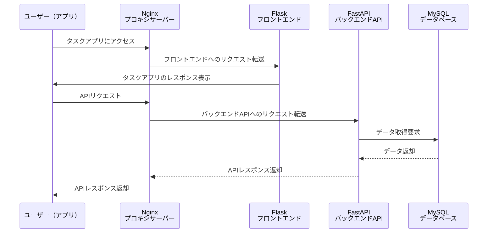
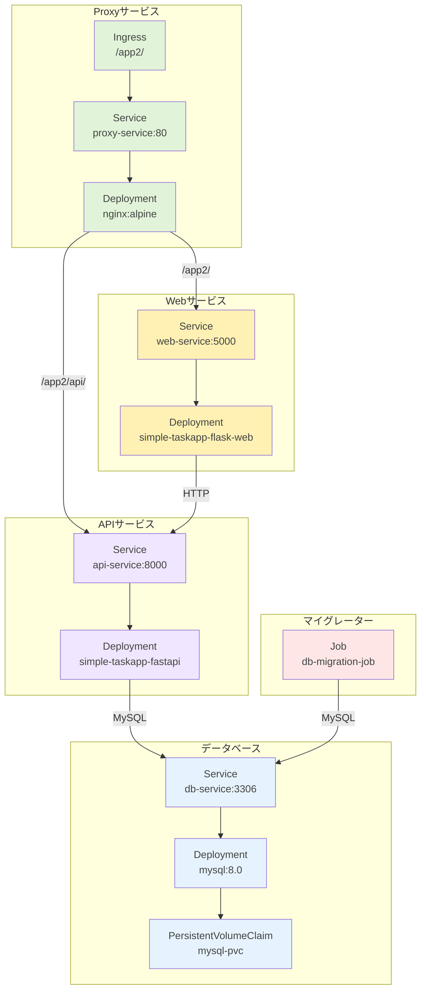
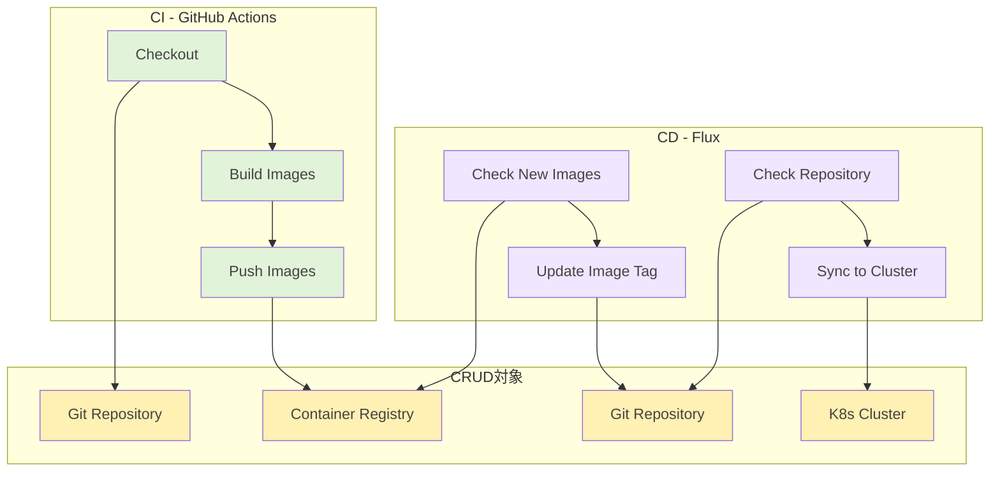

# シンプルなタスク管理アプリケーションのKubernetes化とCI/CD構築

## 1. アプリケーション概要

このアプリケーションは、シンプルなタスク管理システムを実装したマイクロサービスアーキテクチャのWebアプリケーションです。

主な機能：

- タスクの一覧表示
- タスクの追加
- タスクの削除

技術スタック：

- フロントエンド：Flask (Python)
- バックエンドAPI：FastAPI (Python)
- データベース：MySQL
- リバースプロキシ：Nginx
- コンテナオーケストレーション：Kubernetes
- CI/CD：GitHub Actions, Flux

## 2. システム構成図

### 2-1. シーケンス図



### 2-2. K8Sリソース構成



## 3. Kubernetesリソースと各構成要素の対応

### 3.1 主要なKubernetesリソース

1. **Deployment**
    - アプリケーションのコンテナを管理
    - レプリカ数の制御
    - ローリングアップデートの実現
    
    ```yaml
    apiVersion: apps/v1
    kind: Deployment
    metadata:
      name: web-deployment
    spec:
      replicas: 1
      selector:
        matchLabels:
          app: web
    
    ```
    
2. **Service**
    - Pod間の通信を可能にする
        - IPアドレスが自動的に付与
    - 安定したエンドポイントの提供
    
    ```yaml
    apiVersion: v1
    kind: Service
    metadata:
      name: web-service
    spec:
      selector:
        app: web
      ports:
        - protocol: TCP
          port: 5000
    
    ```
    
3. **ConfigMap**
    - Nginxの設定を外部化
    - 環境に応じた設定変更が容易
    
    ```yaml
    apiVersion: v1
    kind: ConfigMap
    metadata:
      name: nginx-config
    data:
      default.conf: |
        server {
          listen 80;
          # ...
        }
    
    ```
    
4. **Job**
    - データベースマイグレーション用
    - 一度だけ実行される処理の管理
    
    ```yaml
    apiVersion: batch/v1
    kind: Job
    metadata:
      name: db-migration-job
    spec:
      template:
        spec:
          containers:
          - name: db-migration
    
    ```
    

### 3.2 Kubernetesクラスタ化のメリット

⇒この資料がわかりやすくまとまっている 
[kubernetes入門 - Speaker Deck](https://speakerdeck.com/cybozuinsideout/introduction-to-kubernetes-2024)

1. **スケーラビリティ**
    - レプリカ数の動的な調整が可能
    - 負荷に応じた自動スケーリング
2. **可用性の向上**
    - 複数Podによる冗長化
    - 自動的な障害検知と復旧
3. **デプロイメントの効率化**
    - ローリングアップデート
    - ゼロダウンタイムデプロイ
4. **構成管理の一元化**
    - マニフェストによる宣言的な管理
    - バージョン管理との連携

## 4. CI/CDパイプラインの構築



### 4.1 GitHub Actions

- Gitのタグ付きでプッシュすると実行
- タグ名（v*）をイメージタグとしてDockerHubにプッシュ

### 4.2 Flux

- リポジトリを定期的に監視してタグの変更情報を取得
- 変更を検知したらリポジトリのK8S設定ファイル内のイメージタグを更新
- K8Sクラスターにもデプロイして同期

### 4.3 イメージ

GitHub Actionsでイメージのビルド＆プッシュ


↓　DockerHubにイメージをプッシュ


↓　FluxのImageControllerがタグの変更を検知


↓　リモートリポジトリのK8S設定ファイルを自動更新


↓　K8Sクラスター（アプリ）にも自動デプロイして同期


## 5. AKSへのデプロイ方法

- xxx