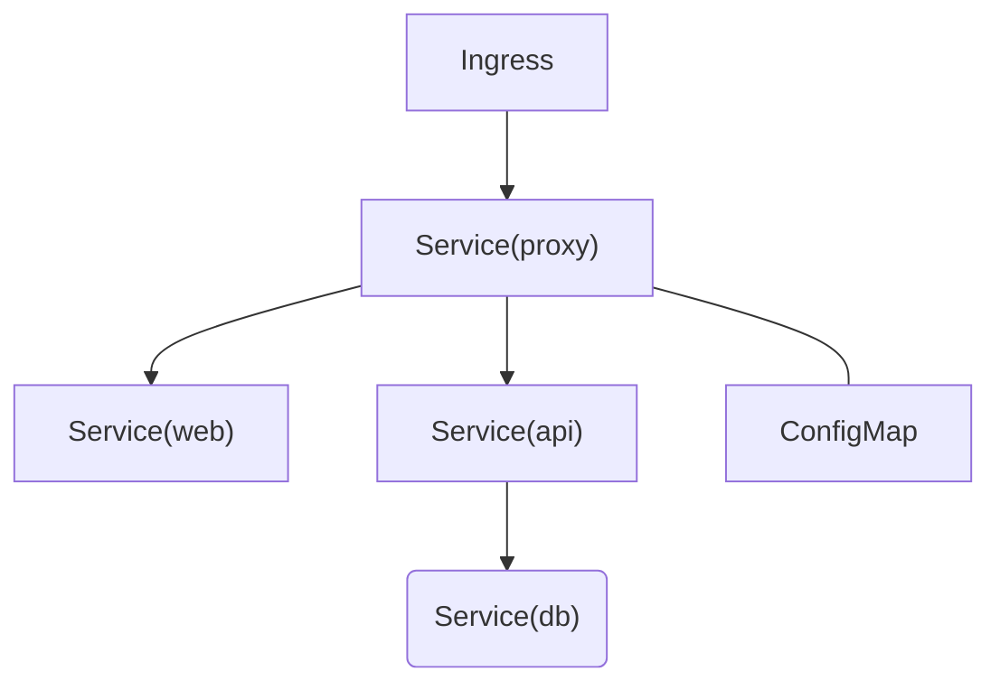

```mermaid
flowchart TB
  node_1["Ingress"]
  node_2["Service(proxy)"]
  node_3["Service(web)"]
  node_4["Service(api)"]
  node_5("Service(db)")
  node_6["ConfigMap"]
  node_1 --> node_2
  node_2 --> node_3
  node_2 --> node_4
  node_4 --> node_5
  node_2 --- node_6
```